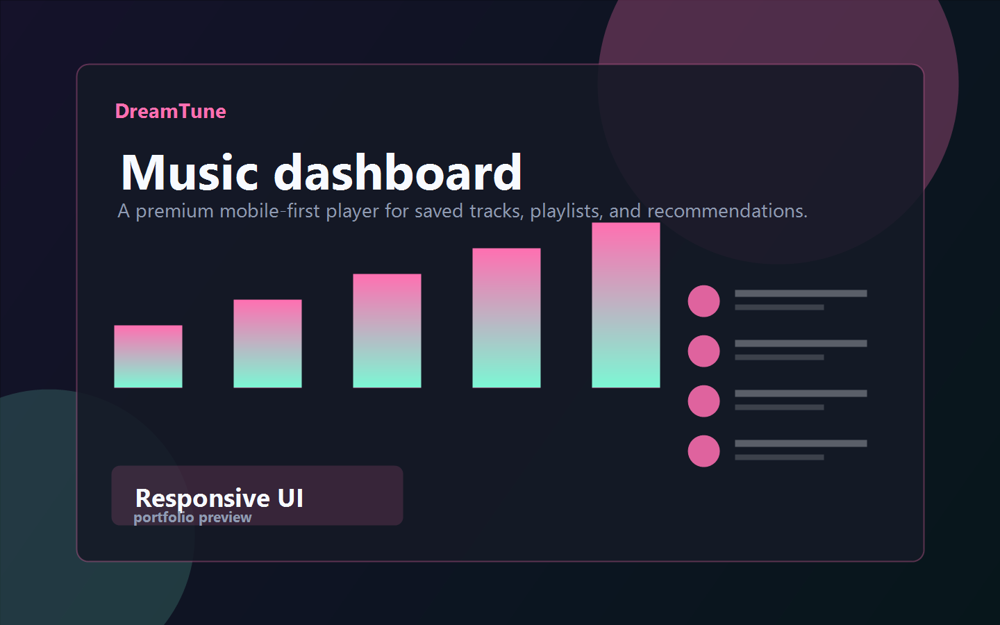
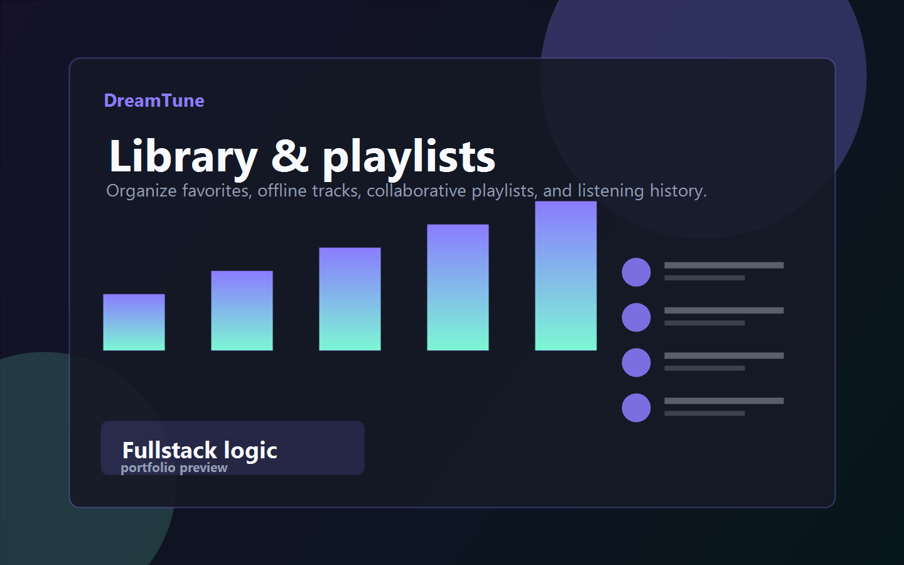
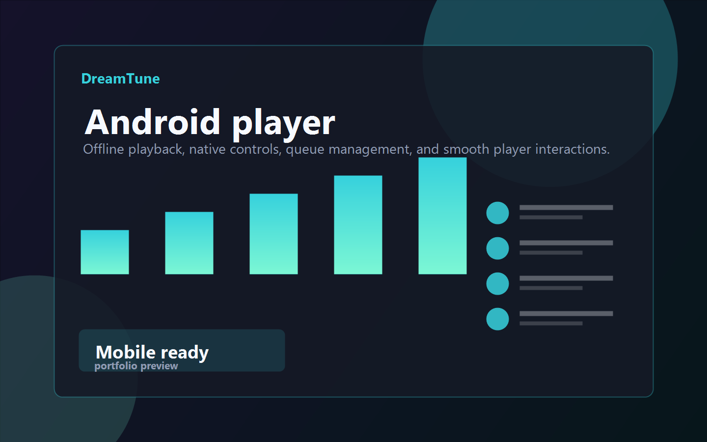

# DreamTune

> A fullstack music player and Android-ready listening experience with Spotify playlist import, YouTube audio sourcing, offline playback, collaborative playlists, and a polished mobile-first UI.



## ✨ Overview

DreamTune is a personal music streaming and library app built as a production-style fullstack project. It solves a simple problem: quickly collect tracks from Spotify/YouTube, organize them into playlists, and keep them available for offline listening on mobile.

The project includes a React frontend, an Express/PostgreSQL backend, media upload and caching logic, Capacitor Android integration, native media controls, lock screen controls, playlist collaboration, and a premium dark UI.

## 🚀 Features

- Authentication with email verification and persistent sessions
- Spotify playlist and track import
- YouTube search and audio download flow
- Offline audio caching for mobile listening
- Android notification player and lock screen media controls
- Playlist, favorite, queue, shuffle, repeat, and sleep timer logic
- Collaborative playlists with invites and friend system
- Track editing with cover crop, trim controls, and lyrics support
- Profile customization with avatar, themes, accent colors, and backgrounds
- Admin dashboard for user and playlist moderation
- Responsive mobile-first UI with dark mode and smooth animations
- Cloudinary/server upload support for audio and cover assets

## 🧱 Tech Stack

**Frontend**

- React 18
- Vite
- Tailwind CSS
- Framer Motion
- Radix UI
- Lucide React
- Capacitor

**Backend**

- Node.js
- Express
- PostgreSQL
- Multer
- Nodemailer
- WebSocket live updates

**Media & Integrations**

- Spotify metadata lookup
- YouTube search/download pipeline
- Cloudinary uploads
- IndexedDB offline audio cache
- Android native media session

## 📸 Screenshots

| Home | Library | Mobile Player |
| --- | --- | --- |
|  |  |  |

## 🏗 Architecture

```text
DreamTune/
├── src/
│   ├── components/
│   ├── hooks/
│   ├── pages/
│   ├── utils/
│   └── api/
├── server/
│   └── index.js
├── android/
│   └── app/
├── public/
├── screenshots/
├── README.md
├── package.json
└── capacitor.config.ts
```

This repository keeps the React app at the root because it is connected to Capacitor Android builds. The backend is isolated in `server/`, while the Android shell lives in `android/`.

## 🔗 Live Demo

- Backend API health: [dreamtune7-dreamtune-api.hf.space/api/health](https://dreamtune7-dreamtune-api.hf.space/api/health)
- Web demo: coming soon
- Android APK: built locally with `npm run android:debug`

## ⚙️ Getting Started

### 1. Clone the repository

```bash
git clone https://github.com/sashik117/DreamTune.git
cd DreamTune
```

### 2. Install dependencies

```bash
npm install
```

### 3. Configure environment variables

Create a local `.env` file from the example:

```bash
cp .env.example .env
```

Then fill in your database, email, Cloudinary, and optional Spotify credentials.

### 4. Run the app locally

```bash
npm run dev
```

Frontend runs with Vite, while the API server runs from `server/index.js`.

## 📱 Android Build

Sync the web build into the Android project:

```bash
npm run android:sync
```

Build a debug APK:

```bash
npm run android:debug
```

APK output:

```text
android/app/build/outputs/apk/debug/app-debug.apk
```

## 🧪 Available Scripts

```bash
npm run dev            # Start frontend and backend together
npm run client         # Start Vite frontend only
npm run server         # Start Express API only
npm run build          # Build frontend
npm run android:sync   # Sync web assets to Android
npm run android:debug  # Build Android debug APK
npm run lint           # Run ESLint
```

## 🎯 Project Goals

- Build a real product-like music app instead of a simple demo player
- Practice fullstack architecture with auth, database, uploads, and real API integrations
- Create a mobile-first interface that feels close to a native music app
- Support offline playback and Android media controls
- Prepare the project for a strong junior/fullstack developer portfolio

## 📬 Contact

- GitHub: [@sashik117](https://github.com/sashik117)
- Project support email: dreamtuneteam@gmail.com
